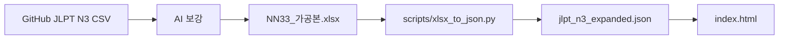

# JLPT N3 Study Project

**JLPT N3 단어를 공부하기 위한 개인용 웹앱**  
**개발:** HTML5 / CSS3 / Vanilla JavaScript (`index.html` 단일 파일)  
**데이터:** `jlpt_n3_expanded.json` (**2,140개** N3 표현)  
**저장:** 브라우저 `localStorage` (계정·서버 DB 없음)

---

## ⚠️ 필수 안내 (반드시 읽어 주세요)

### 오마주 · 참고 앱

이 프로젝트는 앱 스토어의 **「26초」** 를 **오마주**하여, UI·학습 흐름(스와이프 카드, 스키밍 등)을 **비슷하게** 만들어 본 **연습·실험용** 작품입니다.

- **26초** 및 해당 앱의 디자인·브랜드·상표에 대한 권리는 **원 개발사**에 있습니다.
- 본 저장소는 **26초의 공식 앱·후속작·대체 서비스가 아닙니다.**

### 사용 목적 · 상업 이용 금지

| 허용 | 금지 |
|------|------|
| **개인 JLPT N3 공부** | 앱스토어·유료 서비스·광고 수익 등 **상업적 이용** |
| 포트폴리오·GitHub **비영리** 공개 (본 안내 유지) | **26초**를 대체·혼동시키는 마케팅 |
| 코드·데이터 구조 **학습** | 원 앱 UI/카피를 그대로 복제한 **재판매·배포** |

**이미 다른 사람이 만든 앱을 보고 비슷하게 구현해 본 것이므로, 상업적으로 사용하면 안 됩니다.**  
Fork·배포 시에도 위 조건과 [License](#license)를 그대로 유지해 주세요.

---

## 1. 프로젝트 소개

JLPT **N3** 필수 어휘를 **스와이프(스키밍)·플래시카드·퀴즈**로 반복 학습하는 웹 서비스입니다.

- **목적:** N3 시험 대비 **개인 암기** (상업 서비스 아님)
- **UX 참고:** 스토어 앱 **「26초」** 의 카드 스와이프·학습 리듬
- **데이터:** GitHub JLPT N3 CSV → AI로 한국어·예문·관련어 보강 → 엑셀 가공 → JSON

---

## 2. 주요 기능

| 구분 | 기능 | 설명 |
|------|------|------|
| 온보딩 | 카드 스타일 | 애니메이션 / 리얼리즘 (테마 선택) |
| 스키밍 | 스와이프 · 버튼 | **알고 있어요** → 단어팩 / **학습할게요** → 플래시카드 큐 |
| 목표 | D-day · 일일 단어 수 | 시험일, 스트릭, 월간 캘린더 진행률 |
| 플래시카드 | 3단계 자가 평가 | 몰랐던 / 헷갈렸던 / 쉬웠던, 결과·복습 |
| 퀴즈 | 한국어 뜻 입력 | 스키밍에서 본 단어 풀 |
| 라이브러리 | 단어팩 · 보관함 | 북마크, 어려운 단어, 학습 기록 |
| 분석 | 7일 차트 | 스키밍·FC 시간·누적 통계 |
| 카드 | 루비 · TTS · 이미지 | Commons API + Web Speech API |

---

## 3. 기술 스택

| 영역 | 기술 |
|------|------|
| Frontend | HTML5, CSS3, Vanilla JavaScript |
| 데이터 | `jlpt_n3_expanded.json` |
| 영속 저장 | `localStorage` (`jlpt_pro_save_v4`) |
| 폰트 | Pretendard, Noto Sans JP, DM Mono (CDN) |
| 이미지 | Wikimedia Commons → Picsum 폴백 |
| 음성 | Web Speech API (`ja-JP`) |
| 데이터 가공 | **Python** (`pandas` + `openpyxl`) — `NN33_가공본.xlsx` → JSON |
| 원본 단어 | GitHub JLPT N3 CSV + **AI** 보강 |

---

## 4. 데이터 제작 파이프라인



| 단계 | 파일·도구 | 설명 |
|------|-----------|------|
| 1 | JLPT N3 **CSV** (GitHub) | 영문 뜻·읽기 등 원본 |
| 2 | **AI** | 한국어 `meaning`, 예문, `alt_*`, `tip_*` 컬럼 생성 |
| 3 | **엑셀** `NN33_가공본.xlsx` | 가공·검수용 스프레드시트 (시트 `n3`) |
| 4 | **Python** | `xlsx_to_json.py`로 앱용 JSON 출력 |
| 5 | `index.html` | 같은 폴더에서 `fetch('jlpt_n3_expanded.json')` |

엑셀 원본 위치 예:  
`jlpt 웹 사이트 자료/N1~N5엑섹파일/NN33_가공본.xlsx`  
→ GitHub용으로는 `data/NN33_가공본.xlsx`에 복사해 두고 변환 (용량상 repo에 안 올릴 수 있음).

### 4-1. 엑셀 `NN33_가공본.xlsx` (시트 `n3`)

- **1행:** Excel 기본 헤더(`Column1`…) — 변환 시 **무시**
- **2행:** 실제 컬럼명 (`expression`, `reading`, …)
- **3행~:** 데이터 (**2,140행**)

| 엑셀 컬럼 | JSON 필드 |
|-----------|-----------|
| `expression` | `kanji` |
| `reading` | `furigana` |
| `meaning` | `meaning` (한국어) |
| `part_of_speech` | `pos` |
| `words` | `meaning_en` |
| `japanese_example` | `example_jp` |
| `korean_example` | `example_kr` |
| `alt1_expression` / `alt1_furigana` … `alt8_*` | `alt_spellings[]` |
| `tip1_*` … `tip2_*` | `tips[]` |

### 4-2. `jlpt_n3_expanded.json`

앱이 로드하는 최종 형식입니다. 스키마 상세는 이전 README 표와 동일 (`id`, `level`, `kanji`, `furigana`, `meaning`, `example_*`, `alt_spellings`, `tips`).

### 4-3. `reference/content.js` (본 앱과 **무관**)

`N1~N5엑섹파일/content.js` 는 **JLPT 웹앱 코드가 아닙니다.**

- 웹 페이지의 `<video>` 재생 시간에 맞춰 **커스텀 자막**을 띄우는 **브라우저 확장·유저스크립트용** 예제입니다.
- `timeupdate` 이벤트로 10~12초 구간에 `こんにちは` 자막을 표시하는 **데모** 수준입니다.
- JLPT 학습 앱(`index.html`) 빌드·실행과는 연결되지 않습니다.  
  → 자세한 설명: [`docs/content_js.md`](docs/content_js.md)

---

## 5. 프로젝트 파일

```
testtt/
├── README.md                 # 본 문서 (오마주·비상업 안내 포함)
├── index.html                # JLPT N3 웹앱
├── jlpt_n3_expanded.json     # 단어 데이터 (2,140)
├── requirements.txt          # Python: pandas, openpyxl
├── .gitignore
├── data/
│   └── NN33_가공본.xlsx      # (직접 복사) 변환 입력
├── scripts/
│   ├── xlsx_to_json.py       # 엑셀 → JSON
│   └── README.md
├── docs/
│   └── content_js.md         # content.js 설명
└── reference/
    └── content.js            # 참고용 복사본 (앱 미사용)
```

---

## 6. 실행 방법

### 웹앱

```bash
# 프로젝트 루트 (testtt)
python -m http.server 8080
# http://localhost:8080
```

`index.html`과 `jlpt_n3_expanded.json`이 **같은 폴더**에 있어야 합니다.

### JSON 재생성 (엑셀 → JSON)

```bash
pip install -r requirements.txt

python scripts/xlsx_to_json.py -i data/NN33_가공본.xlsx -o jlpt_n3_expanded.json
```

엑셀이 다른 경로에 있을 때:

```powershell
python scripts\xlsx_to_json.py `
  -i "C:\Users\조민재\OneDrive\Desktop\jlpt 웹 사이트 자료\N1~N5엑섹파일\NN33_가공본.xlsx" `
  -o jlpt_n3_expanded.json
```

---

## 7. GitHub 공개 시 체크리스트

- [ ] README 상단 **26초 오마주·비상업** 문구 유지
- [ ] `NN33_가공본.xlsx` / 대용량 CSV는 `.gitignore` 처리 여부 결정
- [ ] `jlpt_n3_expanded.json`만 배포해도 앱 동작 가능
- [ ] 상업 배포·스토어 등록 **하지 않기**

---

## License

**개인 학습·포트폴리오(비상업) 전용.**

- UI·학습 방식은 앱 스토어 **「26초」** 에 대한 **비공식 오마주**이며, **상업적 이용·재판매·공식 앱으로의 오인 유발을 금지**합니다.
- JLPT 원본 CSV, AI 생성 예문·번역, Wikimedia 이미지 등은 각 제공처·도구의 이용 정책을 따릅니다.
- 본 저장소 코드를 사용·공유할 때 위 **필수 안내**를 삭제하거나 왜곡하지 마세요.
